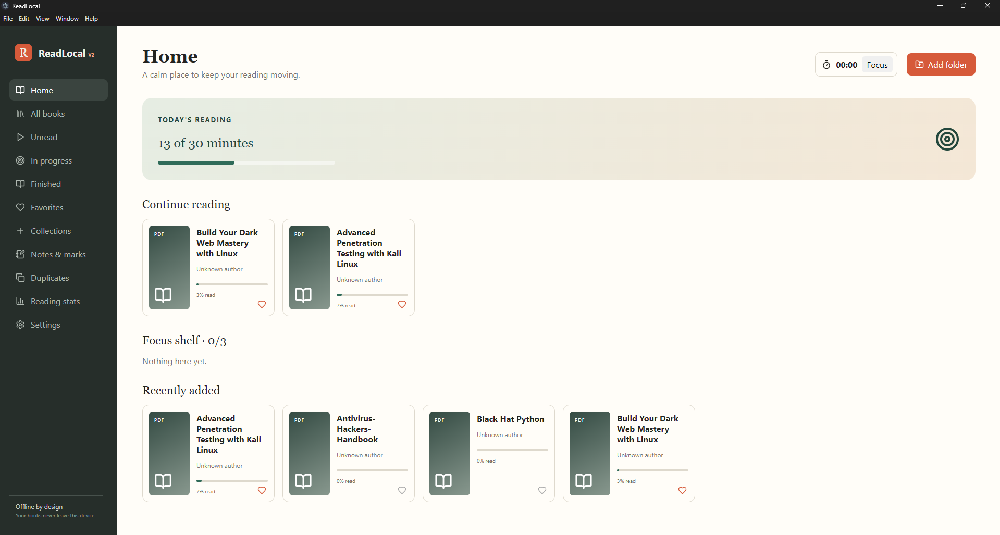
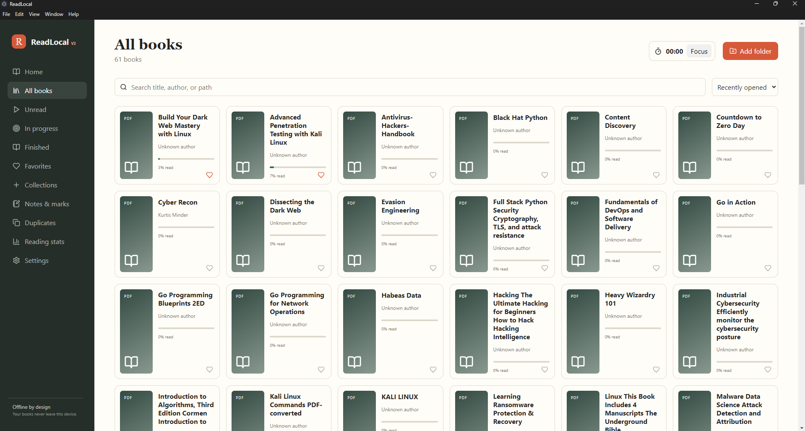
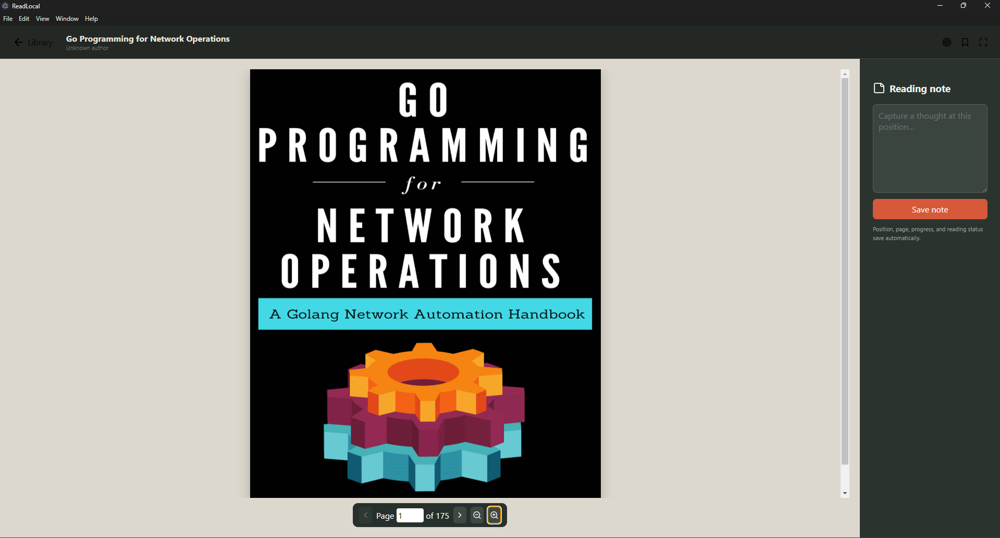
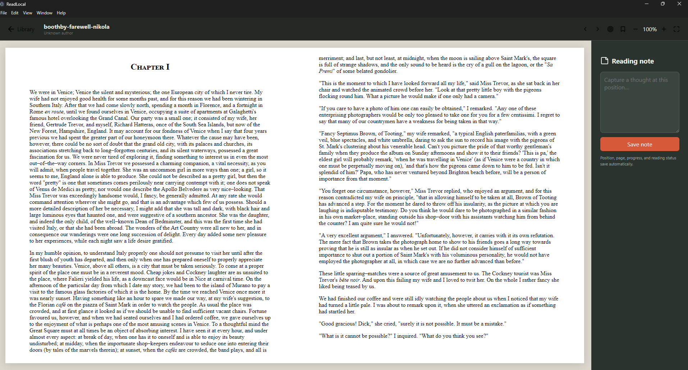
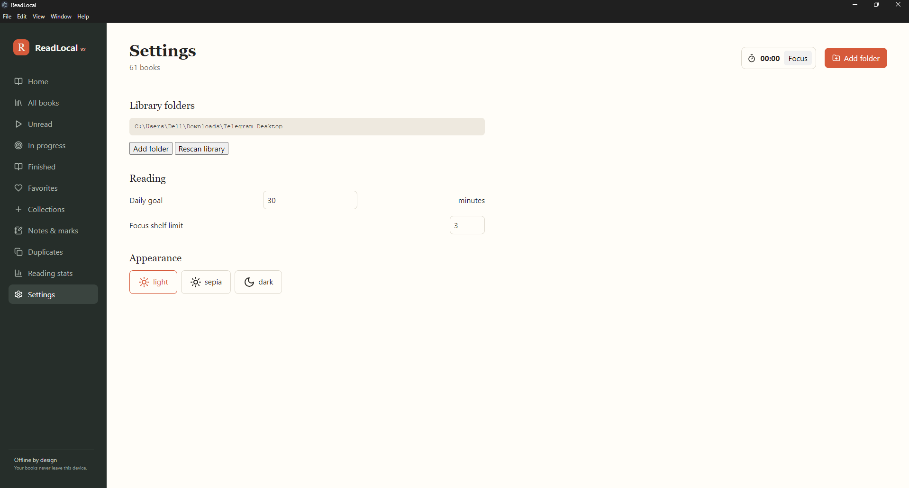

# ReadLocal
> A private, offline-first desktop library and reading companion for PDF and EPUB books.

[](https://github.com/salaudeenabdulkabir/ReadLocal/actions/workflows/ci.yml)


ReadLocal turns folders of ebooks into a focused personal library. It remembers where you stopped, tracks reading time, organizes notes and bookmarks, and keeps every book and activity record on your own computer.

**No account. No cloud database. No book uploads.**

## Why ReadLocal?

Most ebook tools concentrate on storing or displaying books. ReadLocal also helps you maintain a reading habit:

- Continue from the exact EPUB location or PDF page where you stopped.
- Keep a small number of active books on a configurable Focus Shelf.
- Set a daily reading-time goal and run focused reading sessions.
- Review progress, finished books, reading time, bookmarks, notes, and highlights.
- Index existing folders without moving or duplicating the original files.

## Screenshots


```text
docs/screenshots/dashboard.png
docs/screenshots/library.png
docs/screenshots/pdf-reader.png
docs/screenshots/epub-reader.png
docs/screenshots/stats.png
docs/screenshots/settings.png


```


<p align="center">
  
  
</p>
<p align="center">
  
  
</p>
<p align="center">
  
  
</p>


## Features

### Personal library

- Select one or more folders through the native Windows folder picker.
- Recursively index PDF and EPUB files without copying them.
- Automatically watch selected folders for changes.
- Search by title, author, or file path and sort by title or recent activity.
- Browse Unread, In Progress, Finished, Favorites, Collections, and Duplicates.
- Detect likely duplicates using local content fingerprints.

### Reading

- Dedicated PDF.js reader with page navigation, keyboard controls, and zoom.
- Reflowable EPUB reader powered by epub.js.
- Automatic PDF page and EPUB CFI position saving.
- Accurate PDF progress based on current page and total page count.
- Automatic transition to Finished on the final PDF page.
- Light, sepia, and dark themes.
- Distraction-free reading mode.

### Notes and productivity

- Position-linked bookmarks and notes.
- EPUB text-selection highlights.
- Unified Notes & Marks view.
- Configurable Focus Shelf limit.
- Daily reading-time goal.
- Focus-session timer and local reading statistics.
- Favorites and custom collections.

### Privacy and reliability

- No authentication, analytics, telemetry, or remote API calls.
- Books remain in their original folders.
- State is saved under Electron's per-user application-data directory.
- Serialized atomic writes prevent concurrent updates from losing progress or notes.
- Electron context isolation and renderer sandboxing are enabled.

## Quick start

### Requirements

- Windows 10 or 11
- Node.js 20 or newer
- npm 10 or newer

### Development

```powershell
git clone https://github.com/salaudeenabdulkabir/ReadLocal.git
cd ReadLocal
npm install
npm run dev
```

Vite starts the React interface and Electron opens the desktop window. Choose **Add folder** and select a folder containing `.pdf` or `.epub` files.

### Production build

```powershell
npm run build
npm start
```

### Windows installer

```powershell
npm run package
```

## Available commands

| Command | Purpose |
| --- | --- |
| `npm run dev` | Start Vite and Electron in development mode |
| `npm run build` | Type-check and create production bundles |
| `npm start` | Run the compiled desktop app |
| `npm test` | Run the test suite once |
| `npm run test:watch` | Run tests while files change |
| `npm run typecheck` | Check TypeScript without emitting files |
| `npm run package` | Build a Windows installer |

## How it works

```text
Selected book folders
        │
        ▼
Electron scanner ── local content fingerprints
        │
        ▼
Durable local store ── books, progress, notes, goals, sessions
        │
        ▼
Context-isolated preload API
        │
        ▼
React interface ── Library / PDF.js / epub.js
```

Electron owns filesystem and persistence access. The React renderer cannot access Node.js directly; it communicates through a narrow, typed preload API. Watched-folder changes are debounced before the library is rescanned.

## Local data model

| Entity | Stored information |
| --- | --- |
| Books | Fingerprint, metadata, original path, format, progress, position, status, favorite, and collections |
| Bookmarks | Book, saved position, label, and timestamp |
| Notes | Book, reader position, text, and timestamps |
| Highlights | Book, EPUB CFI range, selected text, color, and timestamp |
| Collections | Name, creation time, and book membership |
| Sessions | Book, start/end times, and minutes read |
| Settings | Watched folders, theme, daily goal, and Focus Shelf configuration |

The current durable store is an atomic JSON document named `readlocal-data.json` in Electron's application-data directory. Storage is isolated behind a repository-style class so SQLite can replace it without changing the interface.

## Project structure

```text
electron/
  main.ts          Electron lifecycle, IPC, and folder watcher
  preload.ts       Typed, context-isolated renderer bridge
  scanner.ts       Recursive discovery and duplicate fingerprints
  store.ts         Serialized atomic local persistence
src/
  App.tsx          Library, dashboards, collections, and statistics
  Reader.tsx       Shared reading workspace and EPUB integration
  PdfReader.tsx    Page-aware PDF.js renderer
  store.ts         Zustand application state
  types.ts         Shared domain and IPC types
```

## Tests and verification

```powershell
npm test
npm run typecheck
npm run build
```

Tests cover supported-format detection, fallback metadata, duplicate grouping, and concurrent persistence. The persistence regression test performs 20 simultaneous updates and verifies that none are lost.

## Roadmap

- PDF text-selection highlights and search
- Local full-text extraction and indexing
- Embedded EPUB/PDF cover and metadata extraction
- MOBI, AZW3, FB2, CBZ, and CBR support
- Richer reading streaks and charts
- Optional local AI through Ollama or llama.cpp, disabled by default

Local AI will remain opt-in and will never require sending book contents to a remote service.

## Contributing

Issues and pull requests are welcome. For a code change:

1. Create a focused branch.
2. Run `npm test`, `npm run typecheck`, and `npm run build`.
3. Include screenshots for visible interface changes.
4. Explain any privacy or data-migration impact in the pull request.

Please do not commit copyrighted ebook files or personal library data.

## License

ReadLocal is available under the [MIT License](LICENSE).
